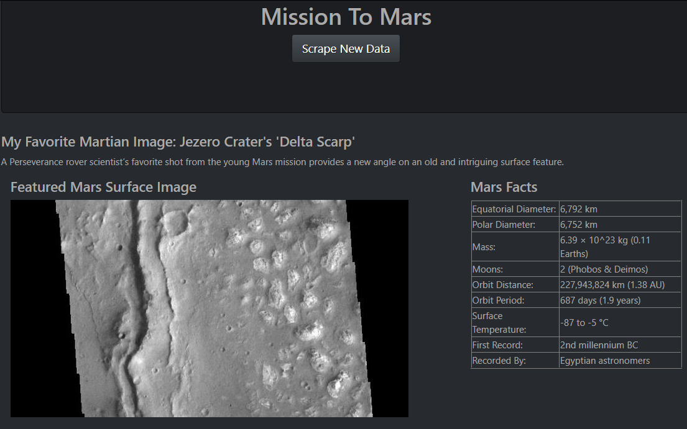
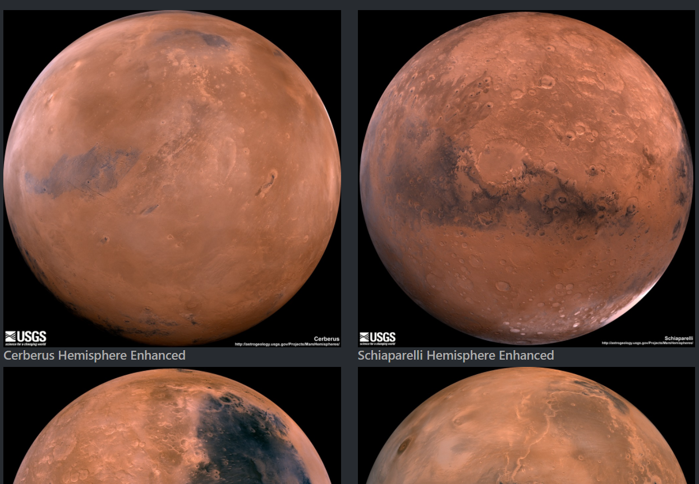

# Mission to Mars


In this project, a web application is built that scrapes various websites for data related to the Mission to Mars and displays the information in a single HTML page. The following outlines the steps taken and information gathered.

## Step 1 - Scraping

Initial scraping tools used are Jupyter Notebook, BeautifulSoup, Pandas, and Requests/Splinter.

### NASA Mars News

* Scraping the [NASA Mars News Site](https://mars.nasa.gov/news/) and collecting the latest News Title and Paragraph Text. The text is set to variables that can be referenced later.

```python
news_title = "My Favorite Martian Image: Jezero Crater's 'Delta Scarp'"

news_p = "A Perseverance rover scientist’s favorite shot from the young Mars mission provides a new angle on an old and intriguing surface feature."
```

### JPL Mars Space Images - Featured Image

* Visit the url for JPL Featured Space Image [here](https://data-class-jpl-space.s3.amazonaws.com/JPL_Space/index.html).

* Splinter is used to navigate the site and find the image url for the current Featured Mars Image. The url string is assigned to a variable called `featured_image_url`.

```python
featured_image_url = 'https://data-class-jpl-space.s3.amazonaws.com/JPL_Space/image/featured/mars2.jpg'
```

### Mars Facts

* The Mars Facts webpage [here](https://space-facts.com/mars/) is visited and using Pandas, the table containing facts about the planet including Diameter, Mass, etc is scraped.

* Pandas is used to convert the data to a HTML table string.

### Mars Hemispheres

* The USGS Astrogeology site is visited [here](https://astrogeology.usgs.gov/search/results?q=hemisphere+enhanced&k1=target&v1=Mars) to obtain high resolution images for each of Mar's hemispheres.

* Each of the links to the hemispheres is clicked in order to find the image url to the full resolution image.

* Both the image url string for the full resolution hemisphere image, and the Hemisphere title containing the hemisphere name are gathered and saved. Using a Python dictionary, the data is stored with the keys `img_url` and `title`.

* The dictionary with the image url string and the hemisphere title is appended to a list. This list contains one dictionary for each hemisphere.

```python
hemisphere_image_urls = [
    {"title": "Valles Marineris Hemisphere", "img_url": "..."},
    {"title": "Cerberus Hemisphere", "img_url": "..."},
    {"title": "Schiaparelli Hemisphere", "img_url": "..."},
    {"title": "Syrtis Major Hemisphere", "img_url": "..."},
]
```

- - -

## Step 2 - MongoDB and Flask Application

MongoDB is used with Flask templating to create a new HTML page that displays all of the information that was scraped from the URLs above.

* The Jupyter notebook is converted into a Python script called `scrape_mars.py` with a function called `scrape` that will execute all of the scraping code from above and return one Python dictionary containing all of the scraped data.

* Next, a route called `/scrape` is created that will import the `scrape_mars.py` script and call the `scrape` function.

  * The return value fis stored in Mongo as a Python dictionary.

* A root route `/` is made that will query the Mongo database and pass the mars data into an HTML template to display the data.

* A HTML template file is created called `index.html` that will take the mars data dictionary and display all of the data in the appropriate HTML elements. 




- - -


